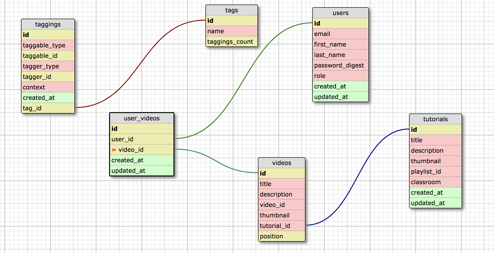

# Brownfield Of Dreams

This is the base repo for a brownfield project used at Turing for Backend Mod 3.

Project Spec and Evaluation Rubric: https://github.com/turingschool-examples/brownfield-of-dreams

### Project Board

Students will continue to build on the existing code base using the cards within the following Github Project: https://github.com/turingschool-examples/brownfield-of-dreams/projects/1

### About the Project

This is a Ruby on Rails application used to organize YouTube content used for online learning. Each tutorial is a playlist of video segments. Within the application an admin is able to create tags for each tutorial in the database. A visitor or registered user can then filter tutorials based on these tags.

A visitor is able to see all of the content on the application but in order to bookmark a segment they will need to register. Once registered a user can bookmark any of the segments in a tutorial page.

## Local Setup

First you'll need to setup an API key with YouTube and have it defined within `ENV['YOUTUBE_API_KEY']`. There will be one failing spec if you don't have this set up.

Clone down the repo
```
$ git clone
```

Install the gem packages
```
$ bundle install
```

Install node packages for stimulus
```
$ brew install node
$ brew install yarn
$ yarn add stimulus
```

Set up the database
```
$ rake db:create
$ rake db:migrate
$ rake db:seed
```

Run the test suite:
```ruby
$ bundle exec rspec
```

## Technologies
* [Stimulus](https://github.com/stimulusjs/stimulus)
* [will_paginate](https://github.com/mislav/will_paginate)
* [acts-as-taggable-on](https://github.com/mbleigh/acts-as-taggable-on)
* [webpacker](https://github.com/rails/webpacker)
* [vcr](https://github.com/vcr/vcr)
* [selenium-webdriver](https://www.seleniumhq.org/docs/03_webdriver.jsp)
* [chromedriver-helper](http://chromedriver.chromium.org/)

### Versions
* Ruby 2.4.1
* Rails 5.2.0

## A Peak into our Code:

### Database Schema
Our first step in this brownfield project was to understand the relationships involved.  We came up with this schema as a starting point:


### Facades
New for us on this project was the concept of facades.  We used several to control various services throughout our project.  Once such facade looked like this:
```
class UserDashboardFacade
  def initialize(user)
    @user = user
  end

  def find_all_followers
    data = service.find_followers
    data.map do |raw_follower|
      Follower.new(raw_follower)
    end
  end
  ```

### Services
Speaking of services, this was also a new concept for us to explore.  Because we are consuming APIs from various places, we needed a way to control this.  One of our services, we called the Github_Service.  We used methods in this class to get our json response back from the API.
```
class GithubService
  def initialize(user)
    @user = user
  end

  def find_repos
    get_json('/user/repos')
  end

  def find_followers
    get_json('/user/followers')
  end
  ```

## POROs
It made sense to us to create a few plain old Ruby objects for this project, and I'm still enjoying the old shortcuts from our first few weeks at Turing.
```
class Following
  attr_reader :login, :html_url, :user
  def initialize(attributes)
    @login = attributes[:login]
    @html_url = attributes[:html_url]
    @user = false
  end
  ```

## Authorization
We used OmniAuth for our authorization. Another new tech for us!

## Testing
We used RSpec for testing and kept track of our test coverage through SimpleCov

## Contributors
Ali Benetka - https://github.com/abenetka
Leah Miller - https://github.com/le3ah
